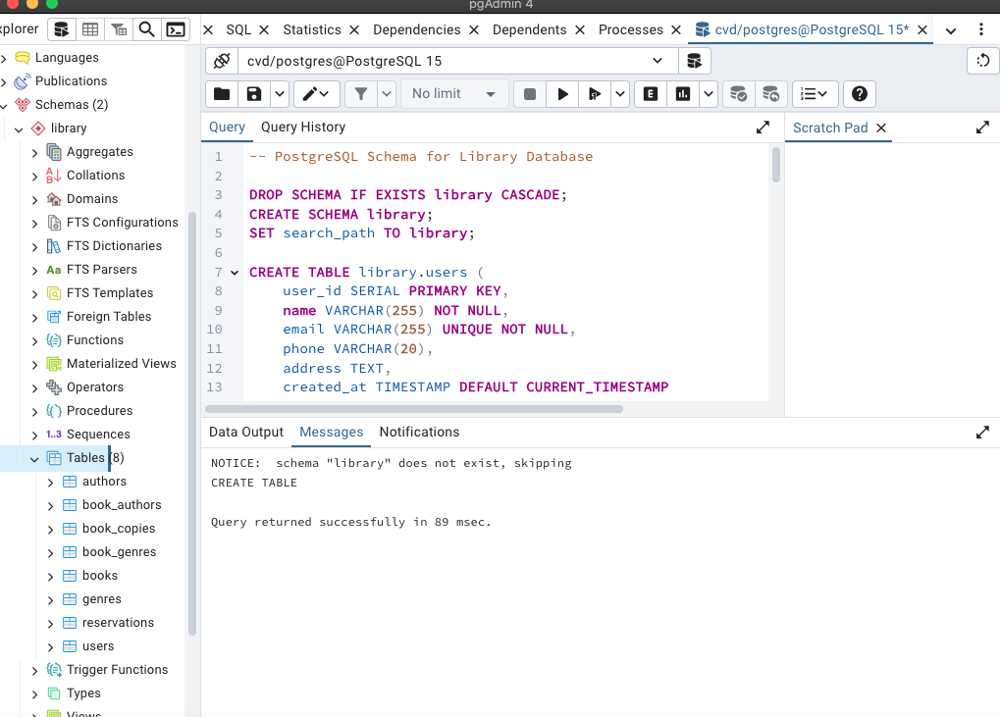

# Library Database Schema

This repository contains the schema and sample data for a library database. The schema includes tables for users, authors, genres, books, book authors, book genres, book copies, and reservations.

## Database Schema

The database schema is defined in the `mysql_schema.sql` or `postgresql_schema.sql` file. Below is a visual representation of the schema using PostgreSQL:




## Sample Data

Sample data for the database is generated using the `generate_sample_data.py` script. To generate and load the sample data into your MySQL database, run the following commands:

```bash
chmod +x generate_and_load_data.sh
./generate_and_load_data.sh
```

This will generate the sample data and load it into your MySQL/PostgreSQL database.


## Advanced Queries

This section contains advanced SQL queries based on the library database schema. Each query is stored in a separate file in the `queries` directory.

### **1. List All Books Along with Their Authors and Genres**

**Question:**  
Write a query to retrieve a list of books along with their authors and genres. If a book has multiple authors or genres, list them together.

**Answer:**  
Execute the query in `queries/hard_hitting_queries1.sql`.

**Result Picture:** 

### **2. Find Users Who Have Reserved Books But Have Never Borrowed a Copy**

**Question:**  
Retrieve a list of users who have made reservations but have never borrowed a book copy (i.e., no `return_date` set).

**Answer:**  
Execute the query in `queries/hard_hitting_queries2.sql`.


**Result Picture:** 

### **3. Find Books That Have Never Been Reserved**

**Question:**  
List all books that have at least one copy but have never been reserved by any user.

**Answer:**  
Execute the query in `queries/hard_hitting_queries3.sql`.


**Result Picture:** 

### **4. Find Authors Who Have Written at Least 2 Books**

**Question:**  
Retrieve the list of authors who have written at least two different books.

**Answer:**  
Execute the query in `queries/hard_hitting_queries4.sql`.


**Result Picture:** 

### **5. Find Books That Belong to a Genre but Not to Another**

**Question:**  
List all books that belong to the genre "Science Fiction" but NOT to the genre "Fantasy."

**Answer:**  
Execute the query in `queries/hard_hitting_queries5.sql`.


**Result Picture:** 
